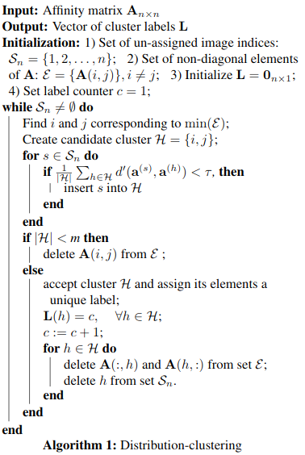

---

---

<h1 id="unsupervised-learning-paper-summaries">Unsupervised Learning Paper Summaries</h1>
<h3 id="table-of-contents">Table of Contents</h3>
<ul>
<li>Unsupervised Learning by Predicting Noise
<ul>
<li><a href="#unsupervised-learning-by-predicting-noise">[summary]</a> <a href="http://proceedings.mlr.press/v70/bojanowski17a.html">[paper]</a></li>
</ul>
</li>
<li>Split-Brain Autoencoders: Unsupervised Learning by Cross-Channel Prediction
<ul>
<li><a href="#split-brain-autoencoders-unsupervised-learning-by-cross-channel-prediction">[summary]</a> <a href="http://openaccess.thecvf.com/content_cvpr_2017/html/Zhang_Split-Brain_Autoencoders_Unsupervised_CVPR_2017_paper.html">[paper]</a></li>
</ul>
</li>
<li>Colorization as a Proxy Task for Visual Understanding
<ul>
<li><a href="http://openaccess.thecvf.com/content_cvpr_2017/html/Larsson_Colorization_as_a_CVPR_2017_paper.html">[paper]</a></li>
</ul>
</li>
<li>Dimensionality’s Blessing: Clustering Images by Underlying Distribution
<ul>
<li><a href="#dimensionalitys-blessingg-clustering-images-by-underlying-distribution">[summary]</a> <a href="https://arxiv.org/abs/1804.02624">[paper]</a></li>
</ul>
</li>
</ul>

<h2 id="unsupervised-learning-by-predicting-noise">Unsupervised Learning by Predicting Noise</h2>

<strong>Main Idea</strong> 
Train the features of a convolutional neural net in a completely unsupervised way by mapping the input features to a set of noise vectors. That is, instead of using ground truth targets such as class labels, the targets are randomly sampled noise. The network tries to minimize the l2 distance from its output to the noise vectors. The authors show that they can train on large datasets like imagenet in a completely unsupervised way, and then use the learned features for classification tasks with only a small drop in accuracy.

<strong>Details</strong> 
Every image in the dataset gets a unique target vector. The target vectors are drawn uniformly from the  <em>d</em>-dimensional unit sphere, where  <em>d</em> is the dimensionality of the feature vectors. We start with  <em>n</em> fixed target vectors, where  <em>n</em> is the number of instances in the dataset. This prevents mode collapse (inputs mapping to the same target) while allowing for an efficient algorithm to optimize the network (having more than  <em>n</em> targets would make the algorithm slower, see the paper). The algorithm is to take mini-batches of  <em>b</em>  images, put them through the network, and then run a Hungarian algorithm to map them to the best target vector. The only targets available are the  <em>b</em> targets previously assigned to those images (this makes the algorithm efficient, aka it scales linearly in the size of the dataset).

<h2 id="split-brain-autoencoders-unsupervised-learning-by-cross-channel-prediction">Split-Brain Autoencoders: Unsupervised Learning by Cross-Channel Prediction</h2>

This paper proposes a novel autoencoder formulation. The network is split into two disjoint networks, each of which are trained to solve a complementary self-supervised task, e.g., one network predicts the color channels from the intensity channel, and the other predicts the intensity channel from the color channels (they use <em>Lab</em>  color space). The networks are then concatenated to form the representations. This task has the advantage over reconstruction autoencoders in that it does not need a compressive representation nor does it need to drop or corrupt the input data.

They show that training the network with a classification-style loss function leads to image representations that provide state of the art results on all tested unsupervised learning transfer tasks.

<strong>Questions</strong>

<ul>
<li>I wasn’t quite clear on how they were able to turn the problem into a classification task – I need to look closer at the details</li>
<li>I’m not sure exactly how the networks are concatenated. The intermediate representations would have to stay on their separate paths, because the weights only connect them along the path of the sub-network. I guess it’s only the final representation that is unified.</li>
</ul>
<h2 id="dimensionalitys-blessing-clustering-images-by-underlying-distribution">Dimensionality’s Blessing: Clustering Images by Underlying Distribution</h2>

This paper presents a method for clustering based on analysis of high-dimensional spaces. They show mathematically that in a high-dimensional space, data points tend to be highly concentrated on a thin hyper-shell, leaving much of the “volume” empty. The consequence of this is that data which come from very similar distributions (in terms of mean and deviation) are actually inherently separable in a high-dimensional space.

Using their mathematical results, they develop a way to cluster data points by their underlying (and unknown) distributions. Their algorithm, which they term  <em>distribution clustering</em>, uses a second-order distance function computed on columns of the affinity matrix of the data. The algorithm has several desirable properties:

<ul>
<li>Clustering chaotic data is a well posed problem</li>
<li>No pre-definition of cluster numbers is required</li>
<li>Innate robustness to outliers, which form their own clusters</li>
</ul>
<h4 id="notes">Notes</h4>

<strong>Notation:</strong>

<ul>
<li><math><semantics><mrow><mi>D</mi><mo>(</mo><mi>m</mi><mo separator="true">,</mo><msup><mi>σ</mi><mn>2</mn></msup><mo>)</mo></mrow><annotation encoding="application/x-tex">D(m, \sigma^2)</annotation></semantics></math>D(m,σ2) – probability distribution with mean <math><semantics><mrow><mi>m</mi></mrow><annotation encoding="application/x-tex">m</annotation></semantics></math>m and variance <math><semantics><mrow><msup><mi>σ</mi><mn>2</mn></msup></mrow><annotation encoding="application/x-tex">\sigma^2</annotation></semantics></math>σ2</li>
<li><math><semantics><mrow><msub><mi>S</mi><mi>n</mi></msub><mo>=</mo><mo>{</mo><mn>1</mn><mo separator="true">,</mo><mn>2</mn><mo separator="true">,</mo><mi mathvariant="normal">.</mi><mi mathvariant="normal">.</mi><mi mathvariant="normal">.</mi><mo separator="true">,</mo><mi>n</mi><mo>}</mo></mrow><annotation encoding="application/x-tex">S_n=\{1,2,...,n\}</annotation></semantics></math>Sn​={1,2,...,n} – set of consecutive integers from 1 to <math><semantics><mrow><mi>n</mi></mrow><annotation encoding="application/x-tex">n</annotation></semantics></math>n</li>
<li><math><semantics><mrow><mi>d</mi><mo>(</mo><mi mathvariant="normal">.</mi><mo>)</mo></mrow><annotation encoding="application/x-tex">d(.)</annotation></semantics></math>d(.) – normalized <math><semantics><mrow><msub><mi>l</mi><mn>2</mn></msub></mrow><annotation encoding="application/x-tex">l_2</annotation></semantics></math>l2​ norm operator
<ul>
<li>For <math><semantics><mrow><mi>x</mi></mrow><annotation encoding="application/x-tex">x</annotation></semantics></math>x in <math><semantics><mrow><msup><mi mathvariant="double-struck">R</mi><mi>k</mi></msup></mrow><annotation encoding="application/x-tex">\mathbb{R}^k</annotation></semantics></math>Rk, <math><semantics><mrow><mi>d</mi><mo>(</mo><mi>x</mi><mo>)</mo><mo>=</mo><mfrac><mrow><mi mathvariant="normal">∣</mi><mi mathvariant="normal">∣</mi><mi>x</mi><mi mathvariant="normal">∣</mi><msup><mi mathvariant="normal">∣</mi><mn>2</mn></msup></mrow><mrow><mi>k</mi></mrow></mfrac></mrow><annotation encoding="application/x-tex">d(x)=\frac{||x||^2}{k}</annotation></semantics></math>d(x)=k<svg width="400em" height="400em" viewBox="0 0 400000 400000" preserveAspectRatio="xMinYMin slice"><path d="M0 0 h400000 v400000 h-400000z M0 0 h400000 v400000 h-400000z"></path></svg>∣∣x∣∣2​</li>
</ul>
</li>
</ul>

<strong>Algorithm:</strong> 
Assume the following:

<ul>
<li><math><semantics><mrow><msub><mi mathvariant="normal">Ω</mi><mi>x</mi></msub><mo>=</mo><mo>{</mo><msup><mi>x</mi><mrow><mo>(</mo><mi>i</mi><mo>)</mo></mrow></msup><mo>:</mo><mi>i</mi><mo>∈</mo><msub><mi>S</mi><mi>n</mi></msub><mo>}</mo></mrow><annotation encoding="application/x-tex">\Omega_x = \{x^{(i)} :  i \in S_n\}</annotation></semantics></math>Ωx​={x(i):i∈Sn​} is a set of vectors (this is the data). We assume that they have been drawn from some set of unknown underlying distributions <math><semantics><mrow><mo>{</mo><msub><mi>D</mi><mn>1</mn></msub><mo>(</mo><msub><mi>m</mi><mn>1</mn></msub><mo separator="true">,</mo><msubsup><mi>σ</mi><mn>1</mn><mn>2</mn></msubsup><mo>)</mo><mo separator="true">,</mo><mi mathvariant="normal">.</mi><mi mathvariant="normal">.</mi><mi mathvariant="normal">.</mi><mo separator="true">,</mo><msub><mi>D</mi><mi>m</mi></msub><mo>(</mo><msub><mi>m</mi><mi>m</mi></msub><mo separator="true">,</mo><msubsup><mi>σ</mi><mi>m</mi><mn>2</mn></msubsup><mo>)</mo><mo>}</mo></mrow><annotation encoding="application/x-tex">\{D_1(m_1, \sigma^2_1), ... , D_m(m_m, \sigma^2_m)\}</annotation></semantics></math>{D1​(m1​,σ12​),...,Dm​(mm​,σm2​)}</li>
<li><math><semantics><mrow><msub><mi mathvariant="bold">A</mi><mrow><mi>n</mi><mo>×</mo><mi>n</mi></mrow></msub></mrow><annotation encoding="application/x-tex">\mathbf{A}_{n\times n}</annotation></semantics></math>An×n​ is the affinity matrix of <math><semantics><mrow><msub><mi mathvariant="normal">Ω</mi><mi>x</mi></msub></mrow><annotation encoding="application/x-tex">\Omega_x</annotation></semantics></math>Ωx​, where <math><semantics><mrow><mrow><mi mathvariant="bold">A</mi></mrow><mo>(</mo><mi>i</mi><mo separator="true">,</mo><mi>j</mi><mo>)</mo><mo>=</mo><mi>d</mi><mo>(</mo><msup><mi>x</mi><mrow><mo>(</mo><mi>i</mi><mo>)</mo></mrow></msup><mo>−</mo><msup><mi>x</mi><mrow><mo>(</mo><mi>j</mi><mo>)</mo></mrow></msup><mo>)</mo></mrow><annotation encoding="application/x-tex">\mathbf{A}(i,j)=d(x^{(i)}-x^{(j)})</annotation></semantics></math>A(i,j)=d(x(i)−x(j))</li>
<li><math><semantics><mrow><msup><mi>a</mi><mrow><mo>(</mo><mi>i</mi><mo>)</mo></mrow></msup></mrow><annotation encoding="application/x-tex">a^{(i)}</annotation></semantics></math>a(i) are the columns of <math><semantics><mrow><mrow><mi mathvariant="bold">A</mi></mrow></mrow><annotation encoding="application/x-tex">\mathbf{A}</annotation></semantics></math>A: <math><semantics><mrow><msup><mi>a</mi><mrow><mo>(</mo><mi>i</mi><mo>)</mo></mrow></msup><mo>=</mo><mrow><mi mathvariant="bold">A</mi></mrow><mo>(</mo><mo>:</mo><mo separator="true">,</mo><mi>i</mi><mo>)</mo></mrow><annotation encoding="application/x-tex">a^{(i)}=\mathbf{A}(:,i)</annotation></semantics></math>a(i)=A(:,i)</li>
</ul>

The clustering is performed on the set of features <math><semantics><mrow><mo>{</mo><msup><mi>a</mi><mrow><mo>(</mo><mi>i</mi><mo>)</mo></mrow></msup><mo>:</mo><mi>i</mi><mo>∈</mo><msub><mi>S</mi><mi>n</mi></msub><mo>}</mo></mrow><annotation encoding="application/x-tex">\{a^{(i)} : i \in S_n\}</annotation></semantics></math>{a(i):i∈Sn​}, using the second-order distance metric 
<math><semantics><mrow><msup><mi>d</mi><mo mathvariant="normal">′</mo></msup><mo>(</mo><msup><mi>a</mi><mrow><mo>(</mo><mi>i</mi><mo>)</mo></mrow></msup><mo separator="true">,</mo><msup><mi>a</mi><mrow><mo>(</mo><mi>j</mi><mo>)</mo></mrow></msup><mo>)</mo><mo>=</mo><msub><mo>∑</mo><mrow><mi>k</mi><mo>∈</mo><msub><mi>S</mi><mi>n</mi></msub><mi mathvariant="normal">\</mi><mo>{</mo><mi>i</mi><mo separator="true">,</mo><mi>j</mi><mo>}</mo></mrow></msub><mo fence="false">(</mo><msubsup><mi>a</mi><mi>k</mi><mrow><mo>(</mo><mi>i</mi><mo>)</mo></mrow></msubsup><mo>−</mo><msubsup><mi>a</mi><mi>k</mi><mrow><mo>(</mo><mi>j</mi><mo>)</mo></mrow></msubsup><msup><mo fence="false">)</mo><mn>2</mn></msup></mrow><annotation encoding="application/x-tex">d'(a^{(i)},a^{(j)})=\sum_{k\in S_n \backslash \{i,j\}}\big(a_k^{(i)} - a_k^{(j)}\big)^2</annotation></semantics></math>d′(a(i),a(j))=k∈Sn​\{i,j}∑​(ak(i)​−ak(j)​)2 
which is the sum of squared differences between the elements of <math><semantics><mrow><msup><mi>a</mi><mrow><mo>(</mo><mi>i</mi><mo>)</mo></mrow></msup></mrow><annotation encoding="application/x-tex">a^{(i)}</annotation></semantics></math>a(i) and <math><semantics><mrow><msup><mi>a</mi><mrow><mo>(</mo><mi>j</mi><mo>)</mo></mrow></msup></mrow><annotation encoding="application/x-tex">a
^{(j)}</annotation></semantics></math>a(j), excluding the <math><semantics><mrow><mi>i</mi></mrow><annotation encoding="application/x-tex">i</annotation></semantics></math>i and <math><semantics><mrow><mi>j</mi></mrow><annotation encoding="application/x-tex">j</annotation></semantics></math>j entries.

The algorithm is show here: 

